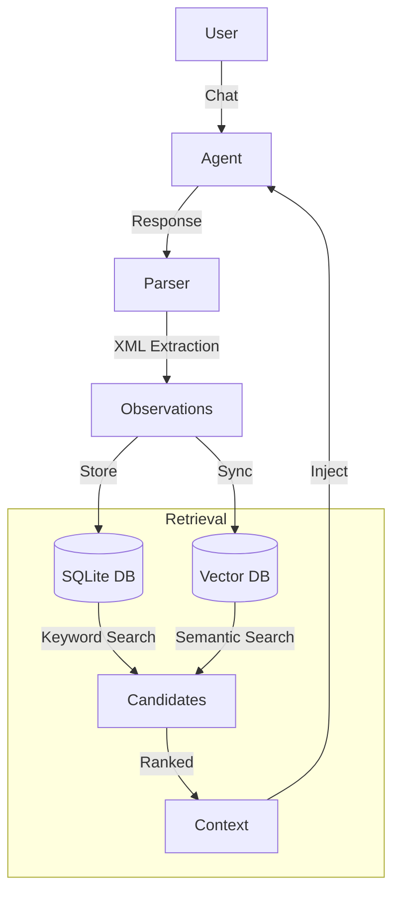

# Analysis: Integrating Memory into Brainless

This document analyzes the `claude-mem` architecture and proposes a strategy for integrating it into the `brainless` agent system.

## 1. Claude-Mem Architecture

`claude-mem` implements a "Memory Augmented Generation" pattern using a local SQLite database and vector search (Chroma).

### 1.1 Core Components

-   **SessionStore (SQLite)**: The primary source of truth. It stores:
    -   `sessions`: Metadata about interaction sessions.
    -   `observations`: Atomic units of knowledge extracted from conversations (e.g., "User prefers TypeScript").
    -   `session_summaries`: High-level recaps of what happened in a session.
    -   `transcript_events`: Raw log of the conversation.

-   **Search Strategy (Hybrid)**: retrieval is a multi-step process:
    1.  **Metadata Filter**: Fast SQLite query to find candidates based on project, time, or keywords.
    2.  **Vector Search**: Semantic search using Chroma (optional but powerful).
    3.  **Ranking**: Combining scores from both sources.

-   **The "Haiku" Compression Pipeline**:
    -   Instead of storing raw text, `claude-mem` uses an LLM (Claude Haiku) to "compress" conversation chunks into specific `<observation>` XML blocks.
    -   This turns unstructured chat into structured data (`title`, `facts`, `narrative`).

### 1.2 Data Flow



## 2. Brainless System Analysis

`brainless` is an agent orchestration framework built on top of `claude-code` hooks. It emphasizes:
-   **Multi-Agent Delegation**: Spawning sub-agents for specific tasks.
-   **Transcript Logging**: Detailed logs of agent activities.
-   **Hooks**: Intercepting shell events (`pre-tool-use`, `post-tool-use`).

### 2.1 Current State
-   **No Persistence**: Agents start fresh each session (mostly).
-   **Hook System**: Strong `bridge.ts` implementation that routes shell events to TypeScript logic.
-   **Missing Dependencies**: `brainless` does not currently have `sqlite3` or `better-sqlite3` in `package.json`.

## 3. Integration Strategy: "The Memory Plugin"

The user requested a "plugin" style integration. Since `brainless` is a CLI tool, we will implement this as a self-contained **Feature Module** (`src/features/memory`) that exposes a clean API to the rest of the system.

### 3.1 Architecture for Brainless

We will adapt the `claude-mem` architecture but simplify it for the first iteration:

1.  **Storage**: Use `better-sqlite3` for a localized, zero-config database file (`.brainless/memory.db`).
2.  **Ingestion**: 
    -   **Passive Capture**: Monitor `post-tool-use` hooks. When an agent completes a task, parse the output/transcript for insights.
    -   **Active Compression**: If the agent's output is unstructured, we may inevitably need a "background" call to a small model (like Haiku) to extract observations, OR we instruct our agents to output `<observation>` tags directly (cheaper, faster). **Recommendation: Prompt Engineering**.

3.  **Retrieval**:
    -   On `session-start`, injection of "Relevant Context" based on the current directory/project.
    -   On `pre-tool-use` (specific tools), inject task-specific memory.

### 3.2 Required Modifications to Brainless

#### A. Dependencies
We need to add database support:
```bash
npm install better-sqlite3
npm install -D @types/better-sqlite3
```

#### B. File Structure
Create `src/features/memory/`:
-   `index.ts`: Public API (`init()`, `save()`, `search()`).
-   `schema.ts`: The SQL definitions.
-   `store.ts`: The `better-sqlite3` wrapper.
-   `parser.ts`: The XML extractor (ported from `claude-mem`).

#### C. Hook Integration (`src/hooks/bridge.ts`)
We need to wire the memory system into the main event loop:

```typescript
// src/hooks/bridge.ts

import { memory } from '../features/memory';

// In processSessionStart
const context = memory.getRelevantContext(process.cwd());
if (context) {
  // Inject into session
}

// In processPostToolUse
const output = input.toolOutput;
const observations = parser.extract(output);
if (observations.length > 0) {
  memory.save(observations);
}
```

#### D. Agent System (`src/agents/`)
Update the system prompts for our agents (e.g., in `src/agents/prompts.ts` or similar) to encourage the generation of `<observation>` tags when they learn something new. This avoids the need for a separate "compression" model call.

## 4. Updates for "Long Term Memory"

To achieve true long-term memory:
1.  **Project-Agnostic Storage**: The database should be stored in a global location (e.g., `~/.brainless/memory.db`) or peer to the workspace, allowing memory sharing across projects.
2.  **Semantic Search**: Eventually, `better-sqlite3` won't be enough for "fuzzy" recall. We will abstract the `SearchStore` interface so we can plug in Chroma/HNSWLib later without rewriting the hooks.
